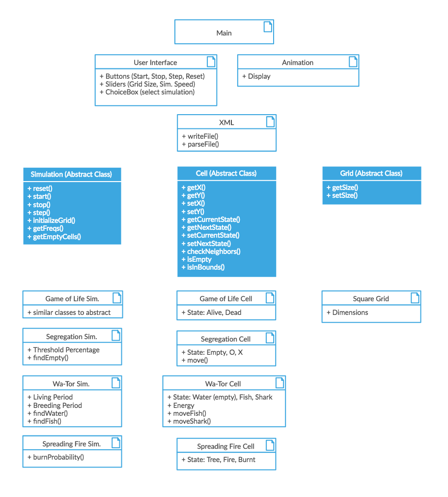

# plan

#### Names:
* Amy Kim (yk154)

* Brooke Keene (bzk2)

* Orgil Batzaya (ob29)
    

### Introduction

The goal of this project is to use JavaFX to design an GUI that allows a user to view different cell automata in the form of a 2D grid. We hope to write code that will allow us to easily add new user interface features and simulations that build off the basic framework of our program. Furthermore, we intend to make sure that customizable features, such as the user defined parameters, are as flexible and extendible as possible. 

We envision that the classes that are responsible for handling the simulations themselves will be "closed", meaning that they are wholly self-contained. The classes which relate to the user interface and animation will be "open" in the sense that they can take in any user-specified simulation and start, stop, step through and reset the simulation on the command of the user.

We expect for the breakdown of our program to fall into 3 categories: front-end, back-end, and XML file handling. The front-end aspects of our project mostly include our user interface that displays our simulation. The back-end pieces of the program will handle the rules and stages of all simulations. The XML part of the project will be what connects our front and back end pieces together, as the XML files will store the data for the initial simulation settings.

### Overview

We envision having a main class that encapsulates everything on a high level and calls a GUI class. Our GUI class will handle the appearance of our user interface, such as creating the buttons and sliders necessary for our program. This class will also be responsible for communicating user input, such as grid size and simulation speed, with the appropriate classes. We also plan for our GUI class to utilize an Animation object that has its own class, which will handle the animation of the simulations.

In addition to our GUI class, we will also have a parent Cell class, a parent Simulation class, and a parent Grid class. All of these classes will be abstract because each of their subclasses, depending on the simulation, might have different implementations for the same methods. Each of these parent classes, Cell, Simulation, and Grid, will have subclasses for each of the different simulations. These subclasses will override certain methods of their parent classes, for example, the checkNeighbors will be implemented differently depending on the simulation's rules. 

Finally, we plan on having an XML class that contains methods to read and write XML files. This class is crucial to our project because it will help 

### User Interface

* User Interface Components
    * Animation Box: contains the simulated grid and displays the animation of the simulation as specified by the user
    * ChoiceBox: allows user to select the simulation they would like to run
    * Buttons: allows user to start/stop/step/reset the simulation.
    * Sliders: allows user to choose the size of the grid and the speed of the simulation

* Cases for Error Pop-up
    * Invalid Grid Size (Size = 0)
    * Unrealistic Speed (Too Slow/Too Fast)
    * Simulation Specific
        * Only Fish/Only Sharks
        * Needed Empty Spaces

### Design Details 

* The GUI class will have start, stop, update, and reset methods that will run/control the simulation
* The Simulation class(es) will act as the "engine" of the program and contain methods that will initialize a Grid and cells, and return quantitative data regarding cell states. 
* The Cell class will have a checkNeighbors() method that will be implemented differently depending on each simulations rules. It will also keep track of its current state and its next state.
* The Grid class will be some 2D data structure that will be called by a Simulation class to populate it with cells and visualized by the GUI; it will know the location of specified cell types.
* The four types of simulation, each will have simulation class and cell class.
    * The cell class will have state and move method. 
        * For example, state method of Game of Life cell will be _alive_ and _dead_.
    * The simulation class will have methods related to simulation. 
        * For example, for Wa-Tor simulation, it will have living period and breeding period which influences states of fish and shark. This simulation class will also have findWater() method for the movement of fish and findFish() method for the movement of shark.

### Design Consideration

**Abstract Classes vs. Inheritance**
* Abstract classes
    * Pros
        * abstract simulation and cell classes will allow us to build upon them and add more to their subclasses in the future
        * works for our purpose because we will need to implement a set of classes such as ... for all instances of these objects
    * Cons
        * because the abstract class itself cannot be used to call methods, we would have to create classes for each distinct simulation
* Inheritance
    * Pros
        * would allow classes to extend a general class with general methods that might apply to some simulations
        * would reduce repeat code possibly
    * Cons
        * might hinder our flexibility in the future

**How to handle UI and Animation**
* Main Class
    * Pros
        * Fewer dependencies, a little easier to understand
        * everything that handles what the user sees is in one place
    * Cons
        * Long code, probably difficult to parse through
* Separate Classes or Modules
    * Pros
        * Easy to distinguish what UI feature is handled by what
    * Cons
        * More organization and proper calls

**Determining Cell Neighbors**
* Cell has checkNeighbors method
    * Pros
        * more independent
    * Cons
        * could be more complicated
* Grid has checkNeighborCells method
    * Pros
        * As it goes through each cells of grid, easier to check
    * Cons
        * less independent because we need to keep checking all the cells of grid instead of checking the specific cells that we only need for.

### Team Responsibilities

* Amy
    * primary: Back-end
    * secondary: Front-end and XML

* Brooke
    * primary: Front-end And XML
    * secondary: Back-end

* Orgil
    * primary: Back-end
    * secondary: Front-end and XML